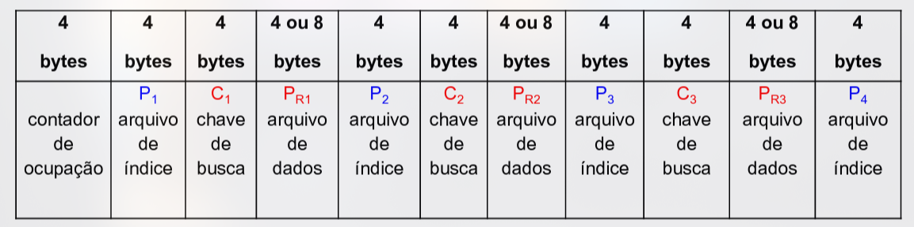

# Estruturas de Indexação

> Estrutura de acesso auxiliar. Ajuda na recuperação de registros.

## Índice Simples ou Linear

* **Chave de Busca**: valores <u>ordenados</u>
* **Campo de Referência**: RRN (tamanho fixo) ou byte offset (tamanho variável)

> Adequado quando cabe em memória primária.
* Em <u>memória secundária</u>, há muitos acessos a disco devido à busca binária. Nesse caso, é melhor usar outras estruturas, tipo Árvore-B, para reduzir custos.

## Operações em um Índice

### Pesquisa

Baseada na chave de busca.
* Encontra o chave no arquivo índice, pega o campo de referência e recupera no arquivo de dados.

### Criação

Criar índice com arquivos de dados novo ou pré-existente.

### Inserção

Inserção de registro no índice após inserção no arquivo de dados. Exige reorganização do arquivo de índices (ordenação).

### Remoção

Análogo à inserção. Pode ser lógica ou física.

### Atualização

Modifica registro no índice, normalmente devido a uma remoção seguida de inserção.

### Carregamento

Carregamento do arquivo de índice na RAM antes de usá-lo.

### Reescrita

Atualiza o arquivo de índices em disco com base no arquivo de índices carregado na RAM.

> Só é possível fazer <u>reescrita</u> de um índice quando ele pode ser armazenado totalmente em memória principal.


## Árvore B

> Método genérico para armazenamento e recuperação de dados.
* Para arquivos volumosos e dinâmicos. Acesso rápido e mínimo overhead.

### Características

#### Balanceada
#### Bottom-up para criação
* Nós-folha -> nó raiz

####  Nó <=> página de disco (4KB)
* Nesse nó, há muitas chaves ordenadas (índices).

### Ordem
* Número máximo de ponteiros que podem ser armazenadas em um nó.
* Árvore-B de ordem 8: 7 chaves e 8 ponteiros (chaves = ponteiros - 1)

### Ideia

* O ponteiro aponta para páginas de disco (nós) com chaves menores que a chave da sua direta e maiores que a chave da sua esquerda.

### Implementação

A estrutura determina cada página de disco.

### Campos de Cabeçalho
* RRN do nó raiz

#### Campos de Dados
* Contador de ocupação -> número de chaves por página
* Chaves de busca
* Referências para o arquivo de dados
* Ponteiros -> referências para o arquivo de índices



## Busca/Pesquisa

> Recursiva a partir da raiz
* Dois estágios: em páginas inteiras e, depois, dentro de páginas


Campo `ehFolha` pode ser inserido no começo do registro para reduzir em 1 busca.

## Inserção

> Toda inserção é feita num nó folha.
> Toda inserção é feita primeiro no arquivo de dados.

### Situações específicas

#### Árvore Vazia (raiz -1)
*  Inserção na raiz até haver overflow

#### Algoritmo
```C
Cria um novo nó


Se existe espaço no nó
    então insere ordenado
Senão // split 1 para 2
    Cria um novo nó
    Distribui as chaves o mais uniforme possível

    // Ordenada e retorna a mediana (direita se par) e o novo nó filho
    Promove uma chave 

    // Shift: dentro de página, carrega o filho direito
    //        para outra página, carrega ambos os filhos
```

Retornos: nó, referência no arquivo de dados, filhos, se houve promoção.

## Remoção


