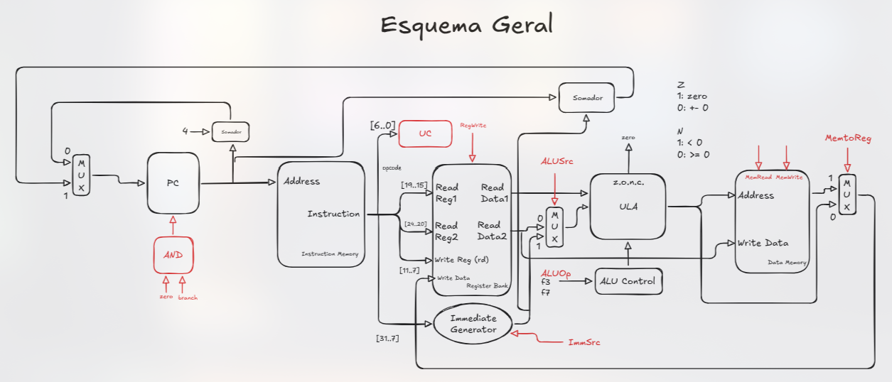

# Tipos das Instruções

> RV32I, 6 tipos.

* **opcode**: 7 bits
* **registradores**: 5 bits
* **f3**: 3 bits; **f7**: 7 bits
    * Agem na Unidade de Controle da ULA
* **imm**: 12 ou 20 bits

Não decorar: `ImmSrc` & `ALUOp`

## R: Register

add, sub, and, or

`<add> <rd>, <rs1>, <rs2>`

[f7 | rs2 | rs1 | f3 | rd | opcode]

Operação da ULA depende da função usada.


## I: Immediate

`lw <rd>, imm(<rs1>)`

[imm | rs1 | f3 | rd | opcode]

opcode: `0000011`: `3`

f3: define o tipo de load: `lb` ou `lw`.

Operação da ULA: soma

## S: Store

`sw <rs2>, imm(<rs1>)`

[imm | rs2 | rs1 | f3 | imm | opcode]

opcode: `01000111`: 4 7

Operação da ULA: soma


## B: Branch


`beq <rs1>, <rs2>, imm`

[imm | rs2 | rs1 | f3 | imm | opcode]

f3: define qual branch é: `beq`, `ble`, `blt`...

Operação da ULA: subtração

A arquitetura soma `imm` ao endereço do `PC` para fazer o jump.

O `imm` tem 12 bits, nesta ordem: [12][10..5] ... [4..1][11]
* Branches pulam half-words em RISC-V, por isso o bit 0 é 0
    * a Unidade Geradora de Valor Imediato multiplica o `imm` por 2 para obter o jump em bytes.
* O bit 12 do immediate (31 da instrução) é de <u>sinal</u>.

```mips

PC ->   beq s1, s0, desvia 
        addi s1, s1, 1      (+2 meias palavras)
                            
desvia: ...                 (+2 meias palavras)
```

Isso equivale a:
`beq s1, s0, 4`. Pula 4 meias palavras (8 bytes).


## U: Upper

`lui <rd>, imm`

[imm | rd | opcode]

Carrega um `imm` de um endereço de memória para os 20 bits mais significativos de um registrador (upper immediate).

`lui s0, 0x01234`

## J: Jump

`jal <rd>, imm`

[ imm | rd | opcode]

Immediate: 20 bits [20][10..1][11][19..12]

`jal s0, -4`


## Etapas das Instruções

1. IF: Instruction Fetch
2. ID: Instruction Decode
3. EX: Execution (ULA)
4. MEM: Memory Access
5. WB: Write Back

### Instruções e seus Números de Etapas

* Tipo R: IF, ID, EX, WB
* Tipo I: IF, ID, EX, MEM, WB (5 ciclos em multiciclo)
* Tipo S: IF, ID, EX, MEM
* TIPO B: IF, ID, EX, MEM (não acessa a memória)


# Implementações

## Monociclo

Todas as instruções são executadas em um ciclo de clock.




## Multiciclo

As instruções são quebradas em etapas, e cada etapa é executada em um ciclo de clock.

### Tempo de Processamento

1000 instruções: 1000 * 10 ns

## Pipeline

As instruções são quebradas em etapas, e etapas de múltiplas instruções são executadas no mesmo ciclo de clock.

As instruções são sobrepostas e realizadas <u>paralelamente</u>.

### Tempo de Processamento

* IF - Instruction Fetch - 3ns
* ID - Instruction Decode - 1 ns
* EX - Execution (ULA) - 2 ns
* MEM - Memory Access - 3 ns
* WB - Write Back - 1 ns

1000 instruções: (4 + 1000) * 3 ns


### Definições

#### Ciclo de Clock
Tamanho da etapa mais lenta.

#### Throughput
Instruções executadas por segundo.

#### Frequência

1/tempo_de_clock.

#### Latência
Tempo para encher o pipeline (IF $\to$ WB).

Número de etapas do pipeline vezes o ciclo de clock. 

Profundidade.


### Conflitos Estruturais

> Disputa por recursos por instruções diferentes, em etapas diferentes, no mesmo ciclo de clock.
* Acesso ao banco de registradores por diferentes instruções.
* Duplicar unidades.
* Acessos independentes.

### Dependência de Dados (bolha)

⚠️ **Bolha** é a parada de uma instrução no pipeline. A instrução é repetida até não haver mais dependência de dados.
* Não atualizamos o `PC`.
* Não atualizamos os registradores da fronteira da fase anterior com a fase da bolha.
    * > NOP - No Operation

#### Hazard (perigo)
Dependência <u>para</u> o pipeline.

#### Dependência Verdadeira 

Read After Write - RAW

> Uso por uma instrução de um operando que depende de execução de uma outra instrução anterior.
* A instrução anterior ainda está em execução no pipeline.


❗É possível fazer `WB` e `ID` no mesmo ciclo.
* Metade 1 do ciclo: escrita no banco.
* Metade 2 do ciclo: leitura do banco.

❗❗Duas instruções entre quem escreve e quem lê: não há parada no pipeline. (não é hazard).
* Solução por software: montador coloca 1 ou 2 `nop` quando há dependência de dados.
 
> Escalonamento de Código
* Reorganização do código para evitar ao máximo o uso de `nop`.
* Analogia: Ordenação Topológica.

#### Dependência Falsa

Só existe se houver <u>execução</u> fora de ordem.
* Etapas são in-order, exceto a etapa de execução.

> Anti-Dependência
* WAR - Write After Read. Consiste na escrita que antecipa uma leitura que deveria vir antes.

> Dependência de Saída
* WAW - Write After Write. Consiste na escrita que antecipa uma escrita que deveria vir antes.

### Forwarding

#### Forward A

00 $\implies$ Banco de Registradores

01 $\implies$ MUX[(MEM/WB.ALUOutput, MEM/WB.LMD)]

10 $\implies$ EX/MEM.ALUOutput


#### Forward B

00 $\implies$ MUX[(Banco de Registradores, Immediate)]

01 $\implies$ MUX[(MEM/WB.ALUOutput, MEM/WB.LMD)]

10 $\implies$ EX/MEM.ALUOutput

* Usado se *RegWrite = 1* e *EX/MEM.rd != zero*.
* Load Word seguido de função com dependência é <u>hazard</u>.


### Dependência de Controle - `branches`

#### Solução 1

Congela o pipeline (bolhas) até saber se vai pular ou não, independente do resultado da branch.

#### Solução 2

Em `branches`, o `PC` só tem o novo endereço somente quando a `beq` chega ao ciclo de `MEM`, pois é o ciclo anterior (`EX`) calcula o `branch target`.

Nesse caso, `flush`: zerar todos os sinais de controles das 3 próximas instruções: IF/ID (nesse caso, não é controle, mas zero também), ID/EX e EX/MEM.

#### Solução 3

Reduzir o atraso dos desvios. Colocar um comparador na fase de `ID`.
* Isso adianta 2 ciclos de clock. Novo endereço em c = 2, em vez de c = 4.

#### Solução 4 - usa a solução 3

Utilização de Delayed Branch (desvio atrasado).
* A instrução após o desvio é sempre executada (possivelmente uma instrução que vinha antes e que a a branch não depende dela).
* A próxima instrução é chamada Delay Slot (posição de atraso).

#### Solução 5: Predição

Tenta prever o comportamento do desvio.

<u>Estática</u>: não permite adaptações em relação ao comportamento do programa.
* Predicted-taken, Predicted-untaken (solução 2), via opcode, backward-taken + forward-not-taken (loop).

<u>Dinâmica</u>: utiliza mecanismos de hardware que predizem via comportamento daquele desvio no passado.

* Branch-Prediction Buffer (1 bit) => Branch Target Buffer: usa índice pra ver se houve desvio anteriormente e guarda último `branch target`.

* Branch-Predction Buffer (2 bits) => Strong & Weak PT & PNT.
#### Solução 5: Predição

Tenta prever o comportamento do desvio.

<u>Estática</u>: não permite adaptações em relação ao comportamento do programa.
* Predicted-taken, Predicted-untaken (solução 2), via opcode, backward-taken + forward-not-taken (loop).

<u>Dinâmica</u>: utiliza mecanismos de hardware que predizem via comportamento daquele desvio no passado.

* Branch-Prediction Buffer (1 bit) => Branch Target Buffer: usa índice pra ver se houve desvio anteriormente e guarda último `branch target`.

* Branch-Predction Buffer (2 bits) => Strong & Weak PT & PNT.


