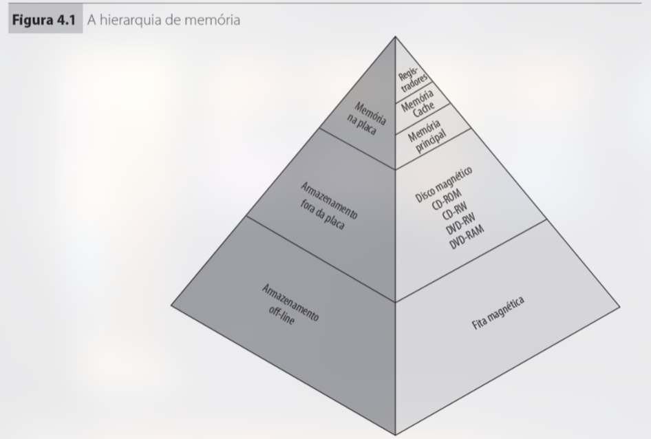

# Hierarquia de Memória

### Curiosidade
* SRAM: Static RAM (Flip Flops)
* DRAM: Dynamic RAM (Capacitor)
* SDRAM: Synchronous Dynamic RAM (Sincronizada com o clock)

* SIM / DIM: Single/Dual Inline Memory (Refere-se aos pinos da RAM)

## Tipos 

### Memória Secundária

=> Dispositivos eletromecânicos que armazenam volume considerável de dados. "Conversam" com a memória primária.

### Memória Primária

=> Veloz. Pode ser endereçada diretamente pelo processador. 

=> Centraliza informações de IO.

=> Volátil

### Interna à CPU - Cache

## Características

### Capacidade

=> Tamanho da palavra x número de palavras

=> Uma palavra é a unidade da organização de memória

### Unidade de Transferência

=> Principal: bits lidos ou escritos de uma vez só

=> Secundária: unidades maiores denominadas blocos

### Formas de Acesso

=> Sequencial: organizado em registros 
* Fita magnética

=> Direto: organizado em blocos; endereçável
* Disco

=> Aleatório: não endereçável; tempo de acesso constante
* Memória Principal

=> Associativa: compara bits com conteúdo de posições de memória
* Cache

### Desempenho

=> Tempo de Latência
* Acesso aleatório: tempo para ler/escrever
* Acesso não-aleatório: tempo para posicionar o mecanismo de leitura/escrita

=> Tempo de Ciclo de Memória
* Memórias de acesso aleatório: tempo necessário para o sistema conseguir realizar um próximo acesso

=> Taxa de Transfer.
* Taxa que os dados podem ser transferidos para dentro/fora da memória

### Físicas

=> Apagável / Não-Apagável (RAM/ROM)

=> Escrita elétrica / máscara

### Organização da Memória

=> Arranjo físico de bits para formar palavra. 

### Leitura / Escrita

=> Apenas leitura: ROM, PROM

=> Majoritariamente leitura: EPROM, EEPROM, Flash

=> Leitura e Escrita: RAM

## ROM - Read Only Memory

=> Tabela binária formada por matrizes. 

=> Endereço normalmente bidimensional.

=> Saída é produto canônico das entradas (AND).

### Aplicações

=> Unidade de Controle e BIOS

## PROM - Programmable ROM

=> Programável apenas 1 vez.

## EPROM - ROM Reprogramável

=> Usa UV

## EEPROM - ROM Reprogramável

=> Elétrica

## Flash - Iguais EEPROM

=> Apaga blocos de memória

